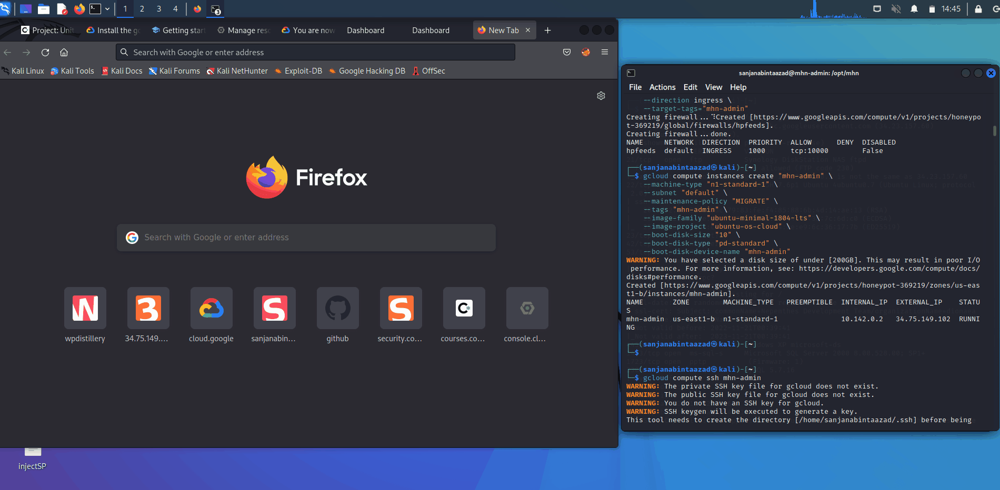
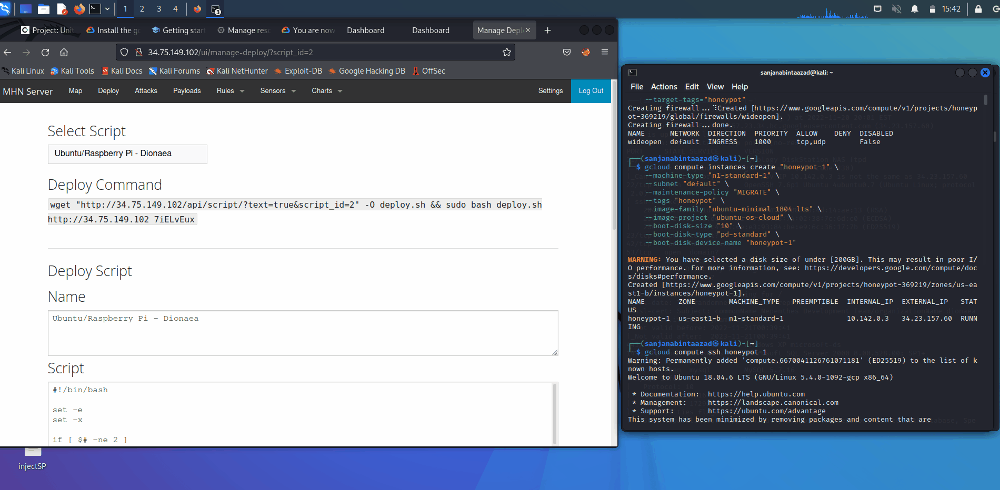
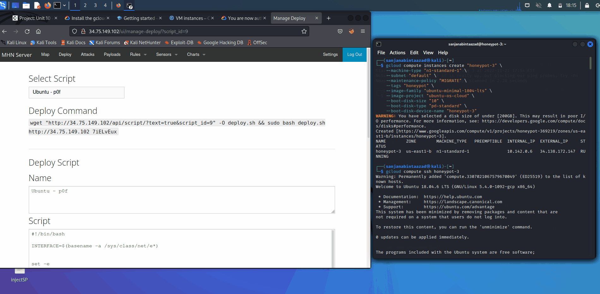
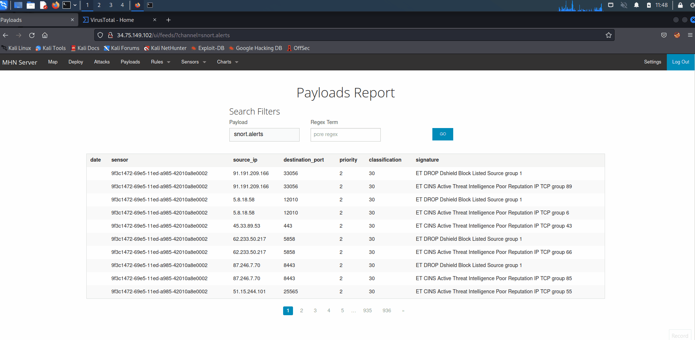
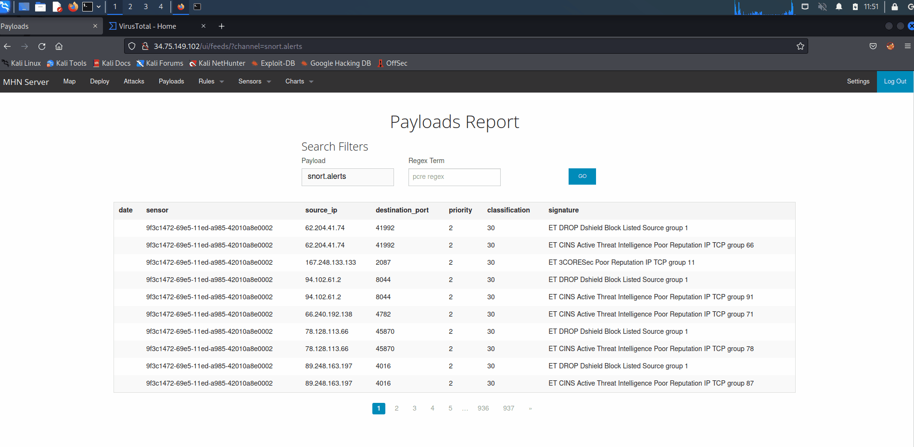

# Honeypot

**Time spent:** **21** hours spent in total

**Objective:** Create a honeynet using MHN-Admin. Present your findings as if you were requested to give a brief report of the current state of Internet security. Assume that your audience is a current employer who is questioning why the company should allocate anymore resources to the IT security team.

## MHN-Admin Deployment (Required)

- [x] **Summary:**
* I deployed MHN-Admin in Kali by creating VM instances & using Google Cloud Platform (GCP) with the following honeypots: Dionaea, Snort & p0f.
* At first I created a google cloud account and then created a project.
* Then I initialized gcloud in the kali terminal and computed specific firewall rules to allow HTTP traffic and all ports from anywhere.
* Then I created the mhn-admin VM, took a note of the external IP address and established SSH access to the VM.
* After establishing SSH access, I installed MHN through the mhn-Admin VM and chose a super user email & password.
* Finally I was able to load the external IP in a browser and login to the MHN admin console via the "superuser" values. I was also able to see the mhn-admin VM instance status through the google cloud web console.

- [x] **GIF Walkthrough:**

## Dionaea Honeypot Deployment (Required)

- [x] **Summary:** 
* Dionaea is meant to be a nepenthes successor, embedding python as scripting language, using libemu to detect shellcodes, supporting ipv6 and tls.
* First I created the firewall rule to allow incoming TCP and UDP traffic on all ports for honeypot sensors, created the VM for dionaea honeypot called honeypot-1, made a note of the external IP and established SSH access to the VM where I executed the deploy command for dionaea that I copied from the MHN admin console.
* Now that the dionaea honeypot is listed in the sensor, I performed an attack using nmap, passing it the external IP of the dionaea honeypot VM. As a result, multiple ports were opened which dionaea was using to attract attackers.
* After the attack in the Attacks page of the MHN Admin console, I was able to see my IP address listed with several port scan records which is the evidence that the honeypot intercepted my attack.
* Attacks from other IPs were also coming in at an alarming rate, from all over the world.
* The most often attacked honeypot was dionaea. This is likely due to a wider attack surface.
* No payload or signatures samples were collected by this sensor.
* Dionaea is able to trap malware exploiting vulnerabilities exposed by services offered to the network. The main goal of Dionaea honeypot deployment is gaining a copy of malware which can be a known or an unknown malware attack.

- [x] **GIF Walkthrough:**

## Database Backup (Required) 

- [x] **Summary:**
* MHN-Admin uses the MongoDB relational database management system for logging events. 
* From the JSON file record we can get the unique identifier, protocol, the timestamp of the connection, the source IP, the source and destination ports, and what honeypot was scanned.
* [session.json](https://github.com/sanjanabintaazad/codepath_homework/blob/Honeypot/session.json)

## Deploying Additional Honeypots (Optional)

### 1. Snort Honeypot

- [x] **Summary:**
* Snort is an open source intrusion prevention system capable of real-time traffic analysis and packet logging.
* Like the previous honeypot, I created the VM honeypot-2, established SSH access to the VM, executed the deploy command for snort. I performed an attack using nmap, passing it the external IP of the snort honeypot VM. As a result, my IP address is listed with several port scan records which is the evidence that the honeypot intercepted my attack.
* Snort honeypot uses the TCP protocol.
* This honeypot is attacked less frequently than others.
* Most of the payloads or signature samples were collected by this sensor.
* Snort has three primary functional modes. It can be used as-
  * a packet sniffer like tcpdump
  * a packet logger (useful for network traffic debugging, etc)
  * a full blown network intrusion detection and prevention system.
* It utilizes a combination of protocol analysis and pattern matching in order to detect a anomalies, misuse and attacks.
* Snort is capable of detecting and responding in real-time, sending alerts, performing session sniping, logging packets or dropping sessions/packets when deployed in-line.
* Snort uses a flexible rules language to describe activity that can be considered malicious or anomalous as well as an analysis engine that incorporates a modular plugin architecture.

- [x] **GIF Walkthrough:**

### 2. p0f Honeypot

- [x] **Summary:**
* p0f is a tool that utilizes an array of sophisticated, purely passive traffic fingerprinting mechanisms to identify the players behind any incidental TCP/IP communications (often as little as a single normal SYN) without interfering in any way.
* Same as the other honeypots performed before, I created the VM honeypot-3, established SSH access to the VM, executed the deploy command for pOf. I performed an attack using nmap, passing it the external IP of the pOf honeypot VM. As a result, my IP address is listed with several port scan records which is the evidence that the honeypot intercepted my attack.
* pOf honeypot uses the pcap protocol.
* It is known for highly scalable and extremely fast identification of the operating system and software on both endpoints of a vanilla TCP connection, automated detection of connection sharing / NAT, load balancing and application-level proxying setups.
* It detects dishonest clients / servers that forge declarative statements such as X-Mailer or User-Agent.
* The tool can be operated in the foreground or as a daemon and offers a simple real-time API for third-party components that wish to obtain additional information about the actors they are talking to.
* Common uses for p0f include reconnaissance during penetration tests; routine network monitoring; detection of unauthorized network interconnects in corporate environments; providing signals for abuse-prevention tools and miscellanous forensics.

- [x] **GIF Walkthrough:**

## Malware Capture and Identification (Optional)

### 1. Malware: Win.Ransomware.Wanna-9769986-0

- [x] **Summary:** 
* I used the payload reports for dionaea, analyzed it, took a note of the hash file, search it through the [VirusTotal](https://www.virustotal.com/gui/home/search) website and found the malware.
* Dionaea honeypot captured it.
* It spreads by using Eternal Blue exploit in the Windows SMBv1 protocol which allows remote code execution if an attacker sends specially crafted messages. It has the capability to remotely compromised systems, encrypt files and infect other hosts. 
* md5 Hash: 5ffdc8b7825f72a04d5c97b6a4d80e7e
* sha1 Hash: f1afa3f2455319414ee08d08b95bd9ae9446ac20

- [x] **GIF Walkthrough:**

### 2. Malware: Win.Malware.Agent-6404242-0

- [x] **Summary:** 
* I used the payload reports for dionaea, analyzed it, took a note of the hash file, search it through the [VirusTotal](https://www.virustotal.com/gui/home/search) website and found the malware.
* Dionaea honeypot captured it.
* It reads terminal service related keys (often RDP related), the active computer name and the cryptographic machine GUID. It also detects a large number of ARP broadcast requests (network device lookup).
* md5 Hash: 996c2b2ca30180129c69352a3a3515e4
* sha1 Hash: 6d788a5a77719ef3157c409108909da2456bf996

- [x] **GIF Walkthrough:**

## Notes

At the beginning of this project, I tried to install GCP SDK on my local machine but it was not working properly in windows. After some failed attempt, I started to work with kali which was a lot easier. I initially tried installing all of these honeypots under kali 2022.3 version but realized the cowrie VM wasn't returning anything. Further inspection revealed that there are currently some deployment errors on this version of kali which is not allowing the cowrie VM. I did not wanted to harm the work I have done so far. So I killed the VM and tried the pOf VM, which resulted in success.
