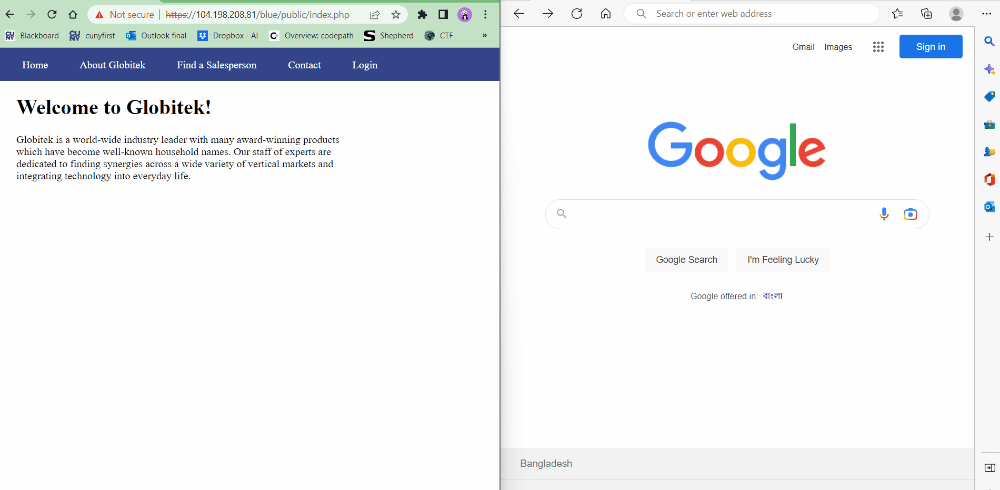
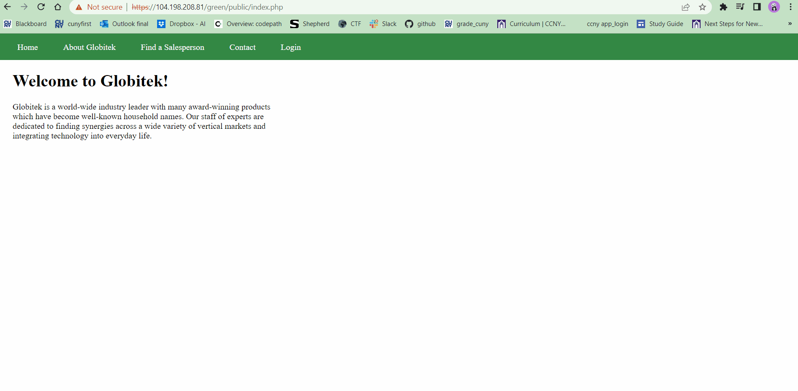
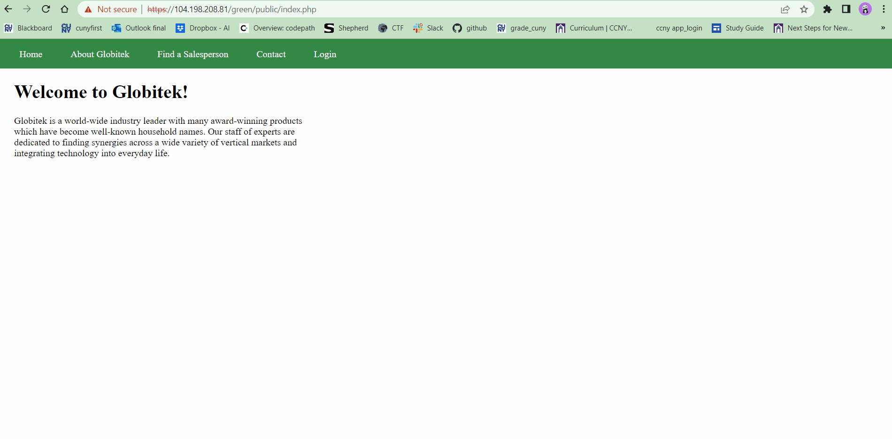
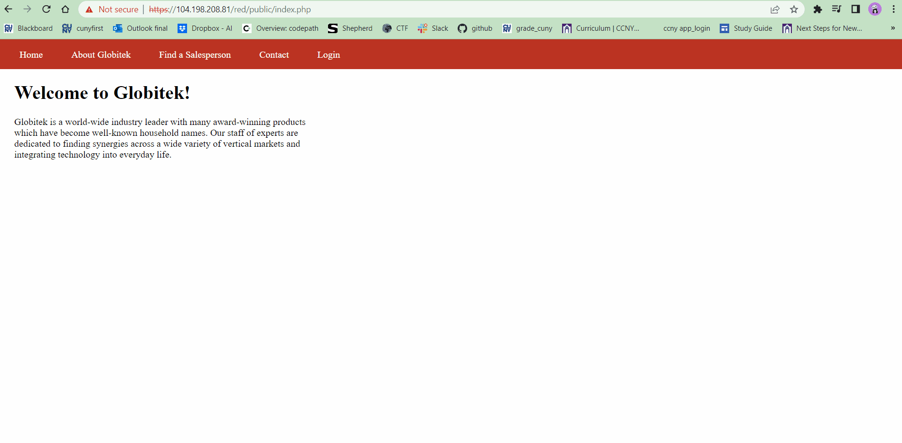
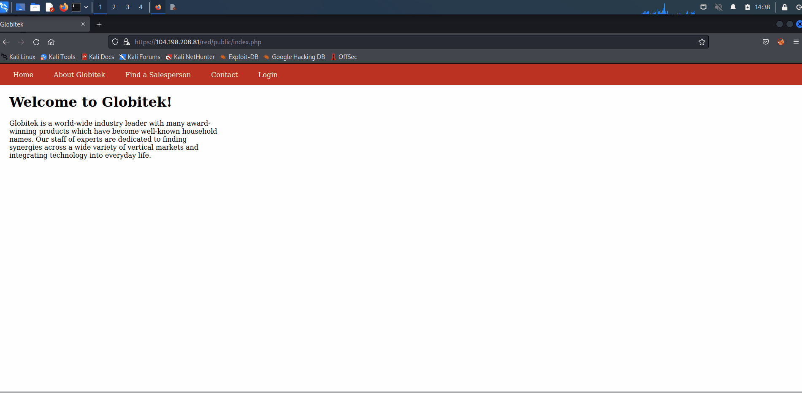

# Pen Testing Live Targets

Time spent: **17** hours spent in total

> Objective: Identify vulnerabilities in three different versions of the Globitek website: blue, green, and red.

The six possible exploits are:

* Username Enumeration
* Insecure Direct Object Reference (IDOR)
* SQL Injection (SQLi)
* Cross-Site Scripting (XSS)
* Cross-Site Request Forgery (CSRF)
* Session Hijacking/Fixation

## Blue

#### Vulnerability 1: SQL Injection (SQLi)

- [x] Description:
  - If we put `'` in the id parameter of the URL and get database query failed, then the webpage is vulnerable to SQL injection.
  - Inserting `' OR SLEEP(5)=0--'` as the value of the id parameter in the URL causes the webpage to sleep for 5 seconds, then shows the information of the user with id=1 by default.
  - Inserting `10' AND SLEEP(5)=0--'` as the value of the id parameter in the URL causes the webpage to sleep for 5 seconds, then shows the information of the user with id 10. We can fetch any other user by changing the id value in the SQL code and make the webpage sleep for the time we want by changing the parameter's value in sleep function.

- [x] GIF Walkthrough:

#### Vulnerability 2: Session Hijacking

- [x] Description:
  - For this exploit we need two different web browsers, let one browser be the attacker and the other the target.
  - Log the target in first. By loading PHP script `public/hacktools/change_session_id.php` while logged in, we can find out the current session ID.
  - open a new session in the attacker browser which is not logged in. Using the same PHP script we can change the attacker's session ID to the target's session ID. Now the attacker browser has unauthenticated access to the logged in session.

- [x] GIF Walkthrough:

## Green

#### Vulnerability 1: Cross-Site Scripting (XSS)

- [x] Description:
  - By putting the following malicious javascript in the feedback section under the "Contact" page and submitting it, an XSS exploit has been created.
 ``
  - When an user is logged in and goes to view the feedbacks, the user will see all the XSS being executed.

- [x] GIF Walkthrough:

#### Vulnerability 2: Username Enumeration

- [x] Description:
  - By using the existing username "jmonroe99" and "pperson" as tests, we found out that if a username exists and entered but with the wrong password, an error message will be displayed which is bolded: **Log in was unsuccessful**.
  - If the username does not exist, the error message will not be bolded: Log in was unsuccessful.

- [x] GIF Walkthrough:

## Red

#### Vulnerability 1: Insecure Direct Object Reference (IDOR)

- [x] Description:
  - When logged in, we can see the salespersons who are not visible to the public.
  - When not logged in, we can go to the "Find a Salesperson" page, select any salesperson and change the value of the id parameter in the URL. Thus we can gain access to the information of the salespersons that are not visible to public.

- [x] GIF Walkthrough:

#### Vulnerability 2: Cross-Site Request Forgery (CSRF)

- [x] Description:
  - By creating a malicious HTML form and executing it will edit the salesperson's data such as their first name and last name.
  - [Malicious HTML Form]()

- [x] GIF Walkthrough:

## Notes

Finding the vulnurabilities was a long process. To identify which color has the specific vulnerability and in which page, I had to perform the same error and trial process in all of the three targets. Executing the correct CSRF form was a bit challenging.
