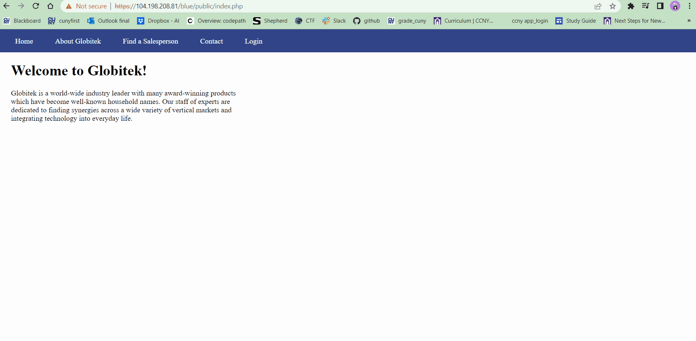

# Pen Testing Live Targets

Time spent: **X** hours spent in total

> Objective: Identify vulnerabilities in three different versions of the Globitek website: blue, green, and red.

The six possible exploits are:

* Username Enumeration
* Insecure Direct Object Reference (IDOR)
* SQL Injection (SQLi)
* Cross-Site Scripting (XSS)
* Cross-Site Request Forgery (CSRF)
* Session Hijacking/Fixation

## Blue

Vulnerability #1: SQL Injection (SQLi)

Description:

Vulnerability #2: Session Hijacking

Description:

## Green

Vulnerability #1: Cross-Site Scripting (XSS)

Description:

Vulnerability #2: Username Enumeration

Description:

## Red

Vulnerability #1: Insecure Direct Object Reference (IDOR)

Description:

## Notes

Describe any challenges encountered while doing the work
